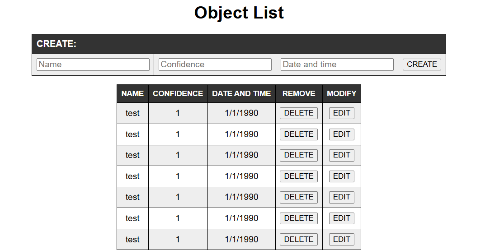
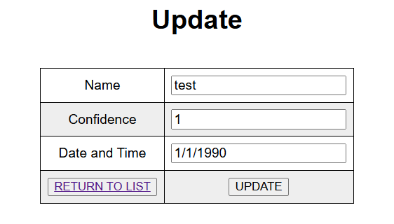

# arm_microservices

Sơ đồ cấu trúc


## Detection

Microservice sử dụng Tiny Yolo v3 neural network để phát hiện vật thể trong hình ảnh hoặc video được tải lên. Kết quả (tên object, confidence, thời gian phát hiện) sẽ được trả về trên terminal, và lưu vào mongodb.

Để bật container:

```bash
docker run -d --name detection -p 5000:5000 lephuclai/gp_detection
```

Để test phát hiện vật thể với Yolo Webservice:

```bash
curl -X PUT -F image_file=@./soccer.jpeg http://localhost:5000/process
```

Kết quả trả về sẽ có dạng:

```bash
 Class: person with confidence: 0.6138224005699158
 Class: person with confidence: 0.4564242362976074
 Class: person with confidence: 0.7284687161445618
 Class: sports ball with confidence: 0.46966585516929626
 Class: sports ball with confidence: 0.6894618272781372
```

## Flask-web

Hiển thị các kết quả phát hiện vật thể được lưu ở trong mongodb. Bên cạnh đó còn có thể thêm/sửa/xóa các bản ghi mới vào mongodb

Service flask-web được chạy trên cổng 5500 để tránh xung đột với service Detection

Giao diện chính của trang web gồm có một form ở trên cùng để tạo mới bản ghi, bảng hiện thi danh sách các bản ghi trong mongodb và thao tác sửa/xóa các bản ghi:



Giao diện sửa bản ghi:



Ta có thể thực hiện các chức năng của web thông qua lệnh curl. Để thực hiện tạo mới bản ghi vào mongodb, ta có thể sử dụng lệnh:

```bash
curl -X POST \ http://localhost:5500/action \ -H 'Content-Type: application/x-www-form-urlencoded' \ -d 'Name=test&Confidence=1&DateTime=1/1/1990’
```

## Mongodb

Sử dụng phiên bản 4.4.14 hoặc là image mongo:4.4.18-focal do các phiên bản mới nhất của mongodb (từ 5.0 trở đi) không còn hỗ trợ arm64.

Các bản ghi được lưu ở trong database `detection` và collection `object`

Đối với trường hợp multiple_pod và multiple_container, khi đăng nhập vào mongo ta sử dụng username `root` và password `root`

## Triển khai các microservices:

- Sử dụng `kubectl apply -f` các file persistance_volume.yaml, pv_claim.yaml, mongo-config.yaml, mongo-secret.yaml trước
- Sau đó sử dụng `kubectl apply -f` các file mongo.yaml, web.yaml, detection.yaml